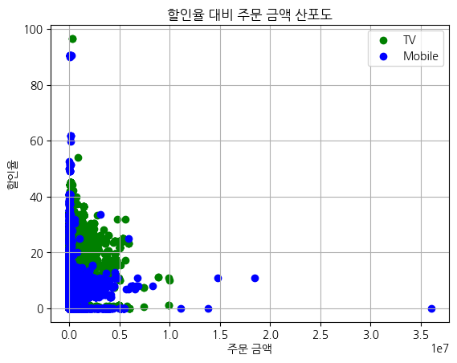

# 산점도
plt.scatter(x, y, color=색상, label=라벨)
```python
# TV 채널 데이터 필터링 및 산포도 그리기
plt.scatter(tv_df['order_amount'],tv_df['할인율'], color='green', label='TV')

# Mobile 채널 데이터 필터링 및 산포도 그리기
plt.scatter(mobile_df['order_amount'],mobile_df['할인율'],  color='blue', label='Mobile')

plt.title('할인율 대비 주문 금액 산포도')
plt.ylabel('할인율')
plt.xlabel('주문 금액')
plt.legend()
plt.grid(True)
plt.show()
```
