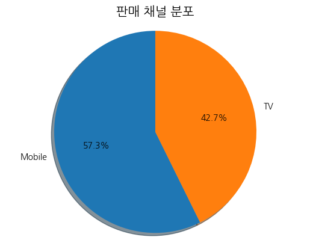

# 파이차트

- autopct = 숫자를 같이 출력(1.1f -> 소수 첫째점 까지)
- shadow = 그림자 유무
- explode = 부채꼴이 파이 차트의 중심에서 벗어나는 정도
- labels = 데이터 라벨
- colors = 색상 지정
- startangle = 파이 원 각도로 돌리기
```python
# 판매채널별 집계
pie_data = df['channel'].value_counts()

# 소수점 첫째까지 값을 표시
# 그림자는 있도록
# 첫번째 부채꼴 그림은 0.1 정도 튀어나오게
plt.pie(pie_data, labels=pie_data.index, autopct='%1.1f%%',
         startangle=90, shadow= True)
plt.title('판매 채널 분포', fontsize=15)
plt.axis('equal')  # 원형을 유지하기 위해 설정
plt.show()
```
