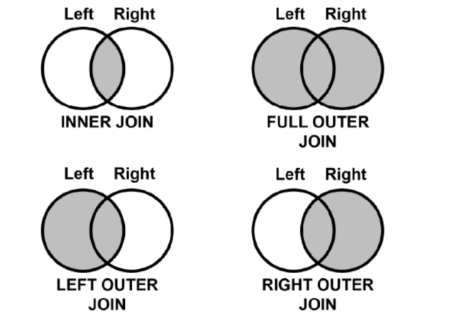

# 데이터 결합

## 1. 조인
### 1.2. merge()
`pd.merge(데이터1, 데이터2, on=기준컬럼, how=결합방법)`
- 결합 방법
  - inner
  - left
  - right
  - outer
```python
# customer와 orders 데이터프레임을 id 컬럼을 기준으로 inner 조인
pd.merge(customer, orders, on='id', how='inner')
```
- 두 데이터의 기준 컬럼명이 다를 경우
  - `pd.merge(데이터1, 데이터2, left_on=데이터1의 기준컬럼, right_on=데이터2의 기준컬럼, how=결합방법)`


```python
# customer의 id 컬럼과 orders의 customer_id 컬럼을 기준으로 결합
pd.merge(customer, orders, left_on='id', right_on='customer_id', how='inner')
```