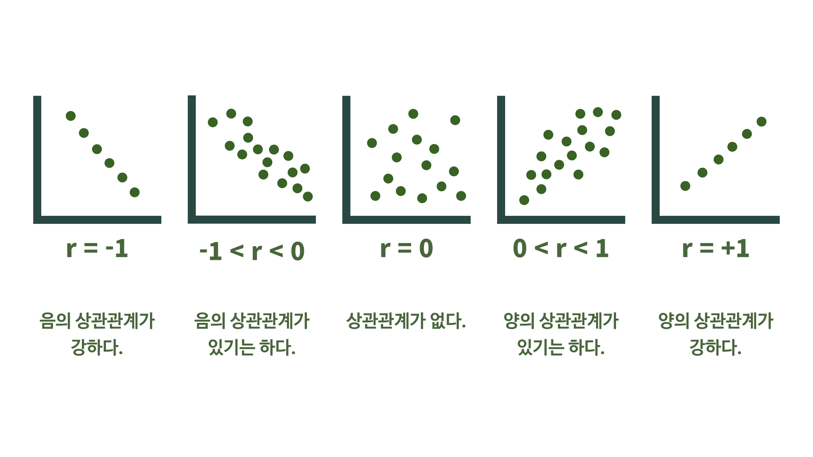

# 상관 관계 확인하기
## 1. 상관 계수
- 상관관계 분석은 두 변수의 관련성을 구하는 분석
- 두 변수 간의 연관된 정도이지 인과관계를 설명하지 않음
- 상관계수 = 두 변수가 함께 변하는 정도 / 두 변수가 각각 변하는 정도 
- 
### 1.1. corr()
상관계수 출력하기
```python
df.corr(numeric_only=True)
```