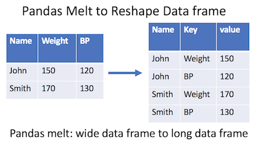

# 피봇 테이블
## 1. 피봇 테이블 만들기
인덱스별 컬럼별 값의 연산 가능
- `pd.pivot_table(데이터명, index=, columns=, values=, aggfunc=)`
  
## 1.1. 단일 인덱스, 단일 컬럼, 단일 값
```python
# Sex컬럼을 행에, Pclass컬럼을 열에 Survivied를 가지고 평균을 구한다.
# 값이 높을수록 생존 확률이 높다.
pd.pivot_table(df, index='Sex', columns='Pclass', values='Survived', aggfunc='mean')
# 연사자를 하나가 아닌 여러 개도 가능
pd.pivot_table(df, index='Sex', columns='Survived', values='Age', aggfunc=['max','min','mean'])
```
### 1.1.1. margin
- margins 옵션을 통해 행과 열 전체의 값도 구할 수 있다.
```python
# 행과 열의 전체 합계 구하기
pd.pivot_table(df, index='Sex', columns='Survived', values='Age', aggfunc='mean', margins=True)
```
## 1.2. 다중 인덱스, 다중 컬럼, 다중 값
```python
# 다중 인덱스, 다중 컬럼, 다중 값을 계산하려면 리스트로 데이터 프레임의 컬럼을 넣으면 된다.
pd.pivot_table(df, index=['Sex','Pclass'], columns=['Survived','Embarked'], values=['Age','Fare'], aggfunc='mean')
```
## 2. 재구조화
```python
# 피봇 테이블 생성
pivot = pd.pivot_table(df, index=['Sex','Pclass'], values=['Survived','Fare'], aggfunc=['mean','median','sum'])
```
### 2.1. stack()
- 컬럼 레벨에서 인덱스 레벨로 데이터프레임을 변경
```python
# 컬럼의 0번째 레벨(=['mean','median','sum'])을 인덱스열로 바꿈
pivot.stack(0)
# 컬럼의 1번째 레벨(=['Survived','Fare'])을 인덱스열로 바꿈
pivot.stack(1)
```

### 2.2. unstack()
- 인덱스 레벨에서 컬럼 레벨로 데이터프레임을 변경
```python
# 인덱스의 0번째 레벨(='Sex')를 컬럼으로 쌓아 올림
pivot.unstack(0)
# 인덱스의 1번째 레벨(='Pclass')를 컬럼으로 쌓아 올림
pivot.unstack(1)
```

## 3. melt
- `pd.melt(데이터명, id_vars=기준 컬럼)`


```python
# 예시 데이터
data = pd.DataFrame({'name':['a','b','c']
                    , 'order_count':[3,4,10]
                    , 'amount':[10000,25000,300000]})

# 'name'열에 있는 데이터 기준으로 데이터 나열
#  var_name, value_name 열 이름 바꾸기(생략 가능)
pd.melt(data, id_vars=['name'], var_name='type', value_name='val')
# | name |    type     |  val  |
# | a    | order_count |   3   |
# | b    | order_count |   4   |
#              ...
# | a    |    amount   | 10000 |
# | b    |    amount   | 25000 |
#              ...  
```
